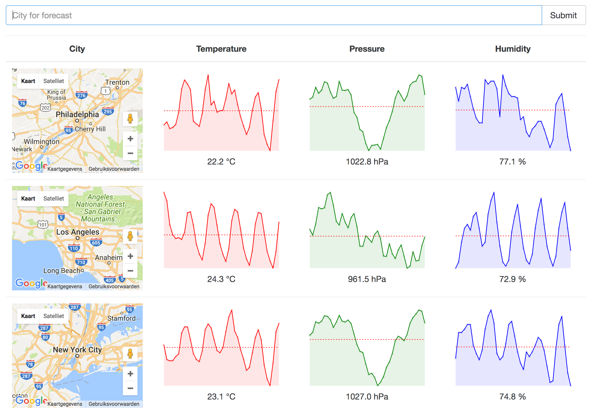

# WeatherReact

This app is a completed version of the Weather app in Stephen Grider's [Modern React with Redux](https://www.udemy.com/react-redux/) course that I can recommend to anyone who wants React/Redux explained clearly.



This app is based on Stephen Grider's starter kit for React/Redux, that you can get [here](https://github.com/StephenGrider/ReactStarter)

This original starter kit is using very old versions of React and other frameworks.
[Here's a fork](https://github.com/roelver/ReduxSimpleStarter) with updated versions as per August,2 2017.

#### Use git to clone this app

```
> git clone https://github.com/roelver/WeatherReact.git
> cd WeatherReact
> npm install
> npm start
```


#### Not Familiar with Git?
Click [here](https://github.com/roelver/WeatherReact/releases) then download the .zip file.  Extract the contents of the zip file, then open your terminal, change to the project directory, and:

```
> npm install
> npm start
```
